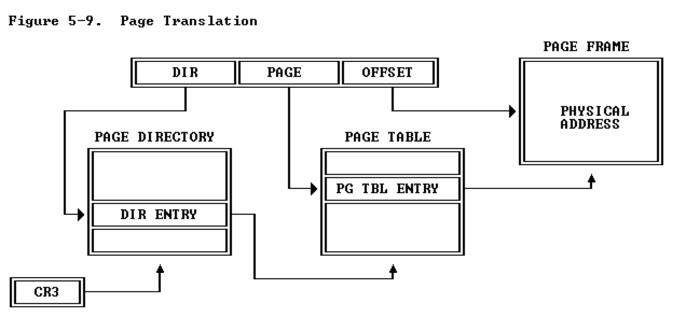
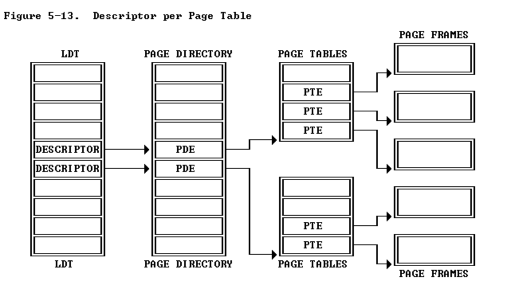

The reason to keep exercise 2 to 5 together is they are actually talking about the same thing.
# Exercise 2
This exercise requires careful read some sections of Intel 80368 Programmer Manual. Here are some important information about these sections:
#### Figure 5-9: Page translation process
  
  
This picture effeciently explain how is a two-level page table looks like. This picture named the 3 components of virtual address as DIR, PAGE and OFFSET. Correspondingly, the first level of the page table is called page directories. The second level is called page tables. The steps of page translation is:  
1. Use the DIR part, which is the first 10 bits of the linear address (also called virtual address in our lab) to find the page table address.  
2. Use the PAGE part, which corresponds to 11-20 bits of the linear address to find the physical address without actual offset.  
3. Add the OFFSET part of our linear address to the physical address without offset we just got in step 2. We get out final physical address.  
  
#### Figure 5-13: More details about the process
  
  
This picture provide more details on this process. Make it easier to implement in code.  
1. According to the picture, the abbreviation of page directory is PDE. We should relate this information to ```pde_t```, which is a variable type frequently shows up in our lab code.  
2. According to the picture, the abbreviation of page table is PTE. We can also relate this information to ```pte_t```, which is another variable type shows up in our lab code.  
3. Both PDE and PTE are stored as arrays. We can use PDE[index] to find a specific element stored in it. By definition, this "element" should be the address of a page table. We can also do similar thing at page table arrays to find the physical address.  
  
  
These information are pretty helpful to our later implementations.
# Exercise 3
